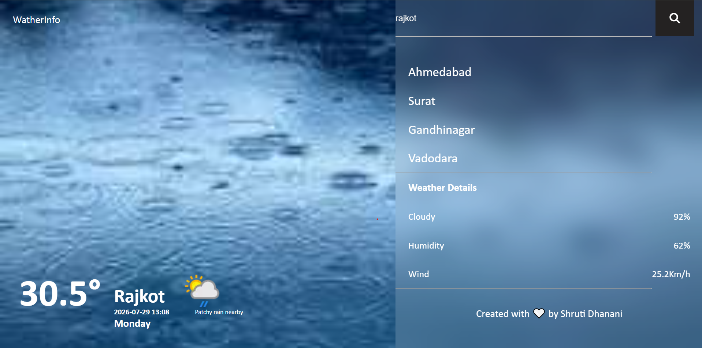
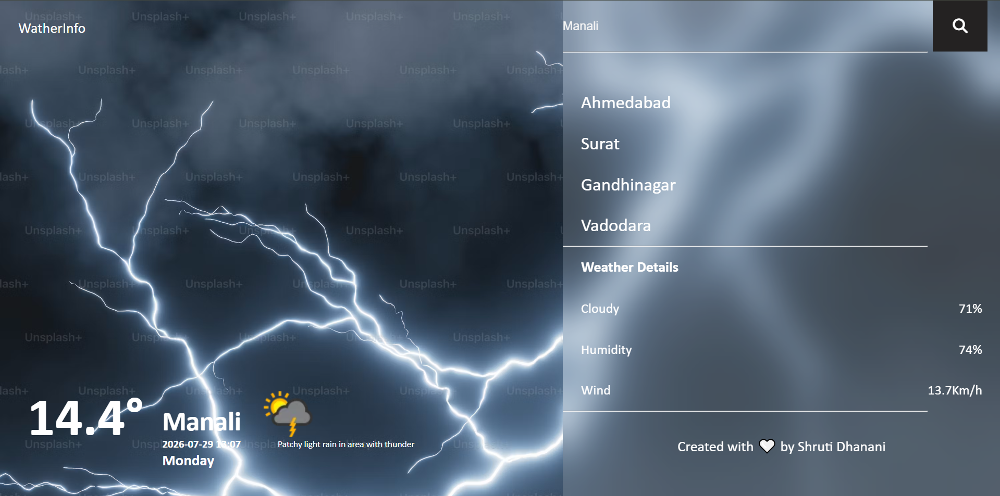
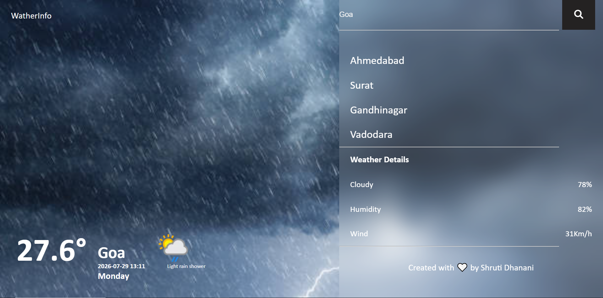

<<<<<<< HEAD
"# WeatherApp" 
=======
# ☁ Wather Application

A responsive and user-friendly Weather Application built using HTML, CSS, and JavaScript.Real-time weather data from the WeatherAPI.

## 🚀 Features
🔍 Search weather by city name

🌡️ Current temperature

📍 City & country information

🕒 Local date and time

☁️ Weather condition

💧 Humidity

🌬️ Wind speed

☁️ Cloud percentage

🌤️ weather icon

🖼️ Background image changes according to weather 

📱 Responsive design

## 🛠️ Technologies Used

HTML

CSS

JavaScript

WeatherAPI

## 📂 Project Structure

index.HTML

📁 CSS

style.css 

📁 JavaScript

script.js 

📁 imges

## 🖼️ Imges 

## 📷 video

https://drive.google.com/file/d/13KihuDvcDEXBVN6F4LMNwNxtjt68PTxJ/view?usp=sharing
>>>>>>> d34f85728f8c315ad898cc86114f693776d22a82
"# WeatherApp" 
